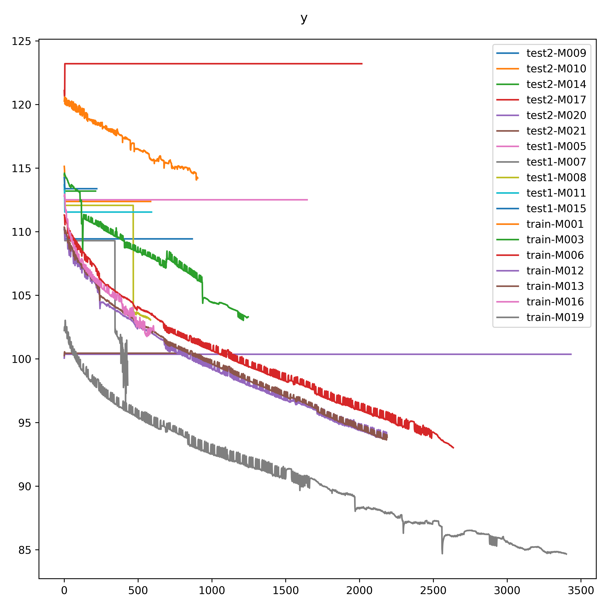

# battery-volume-curve-regression

    Contest solution for 数境创新大赛-新能源储能系统电池容量预测

----

Contest page: [https://www.industrial-bigdata.com/Challenge/title?competitionId=KNJDCW2HR45R8LCU6ZSUVCJRC5SJ3H1P&type=](https://www.industrial-bigdata.com/Challenge/title?competitionId=KNJDCW2HR45R8LCU6ZSUVCJRC5SJ3H1P&type=)  
Problem provider：东方电气  
Team Name: 帕鲁发电站  
Final rank: #34, no award :(

### Quickstart

- `pip install -r requirements.txt`
- `python mk_data.py`
- `python linear_by_ref.py`
- `python mk_submit.py`

⚪ pred

| original | prediction |
| :-: | :-: |
|  |  |

⚪ correlation

----
by Armit
2024/2/14
